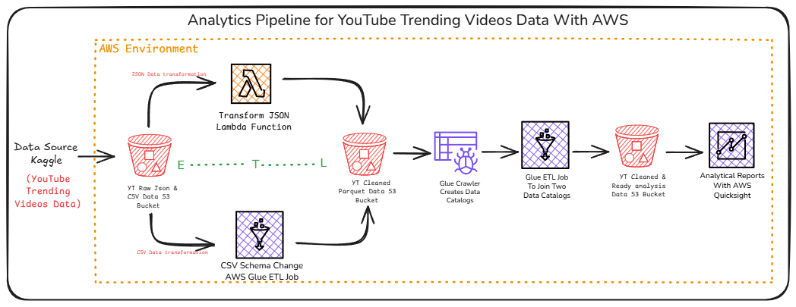

# YouTube Trending Analytics Data Engineering Pipeline

## Overview

This project implements an end-to-end data engineering pipeline to process and analyze trending YouTube video datasets from Kaggle. Leveraging AWS services such as S3, Lambda, Glue, Athena, and QuickSight, the pipeline automates ingestion, transformation, schema management, and visualization of both CSV and JSON data sources across multiple regions.

## Architecture
## Architecture

<p align="center">
  
</p>
- **Data Source:** Kaggle YouTube Trending Videos Dataset (CSV \& JSON, region-wise)
- **Storage:** AWS S3 (Raw and Cleaned Buckets)
- **Transformation:** AWS Lambda (PySpark for JSON to Parquet), AWS Glue ETL (CSV schema management)
- **Cataloging:** AWS Glue Crawlers and Data Catalog
- **Querying:** AWS Athena (table joins and analytics)
- **Visualization:** AWS QuickSight (Actionable dashboards)


## Pipeline Steps

1. **Data Ingestion:**
    - Upload raw CSV and JSON files to the AWS S3 raw bucket.
2. **Transformation \& Cleaning:**
    - **JSON Files:**
        - AWS Lambda (PySpark) script converts JSON files to Parquet format.
        - S3 trigger automatically runs the Lambda function on new uploads.
    - **CSV Files:**
        - AWS Glue ETL pipeline handles unstructured schema and outputs cleaned Parquet files.
3. **Data Cataloging:**
    - AWS Glue Crawlers scan the cleaned S3 bucket and create two tables (from CSV and JSON sources) in the Glue Data Catalog.
4. **Data Integration:**
    - AWS Athena joins both tables to create a unified analytics table.
5. **Final ETL \& Analytics Table:**
    - AWS Glue Studio pipeline creates the final `analytics` table for reporting.
6. **Visualization:**
    - AWS QuickSight connects to the analytics table and generates interactive dashboards and actionable reports.

## Project Structure

```
.
├── lambda/
│   └── pyspark_json_to_parquet.py
├── glue/
│   └── csv_schema_etl_job.py
├── athena/
│   └── join_tables.sql
├── quicksight/
│   └── dashboard_screenshots/
├── README.md
└── architecture_diagram.png
```


## AWS Services Used

- **S3:** Data storage (raw and cleaned datasets)
- **Lambda:** Serverless transformation (PySpark)
- **Glue:** ETL pipelines, schema management, and data cataloging
- **Athena:** Serverless querying and table joins
- **QuickSight:** Data visualization and reporting


## Getting Started

1. **Clone the Repository:**

```bash
git clone https://github.com/yourusername/youtube-trending-analytics-pipeline.git
```

2. **Upload Data:**
    - Download the [YouTube Trending Videos Dataset](https://www.kaggle.com/datasets/rsrishav/youtube-trending-video-dataset) from Kaggle.
    - Upload CSV and JSON files to the designated S3 raw bucket.
3. **Deploy Lambda Function:**
    - Use the provided PySpark script in the `lambda/` folder.
    - Set up an S3 trigger for automatic execution.
4. **Configure Glue Jobs:**
    - Create Glue ETL jobs using the scripts in the `glue/` folder.
    - Set up Glue Crawlers for data cataloging.
5. **Run Athena Queries:**
    - Use the SQL scripts in the `athena/` folder to join tables.
6. **Set Up QuickSight:**
    - Connect to the analytics table and build dashboards.


## License

This project is licensed under the MIT License.
